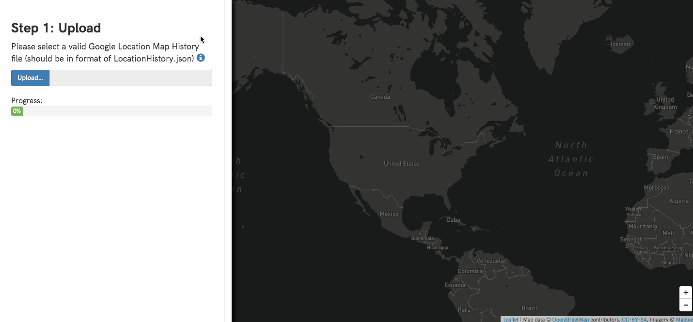
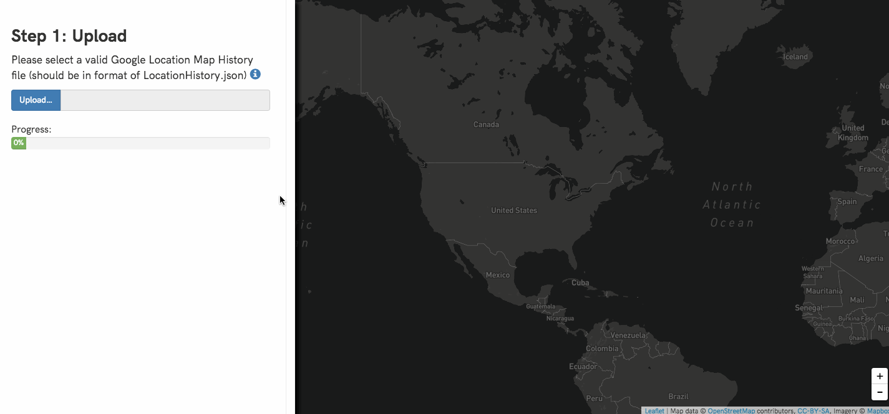
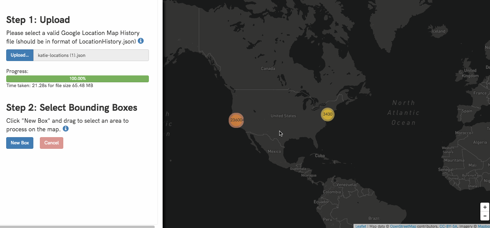
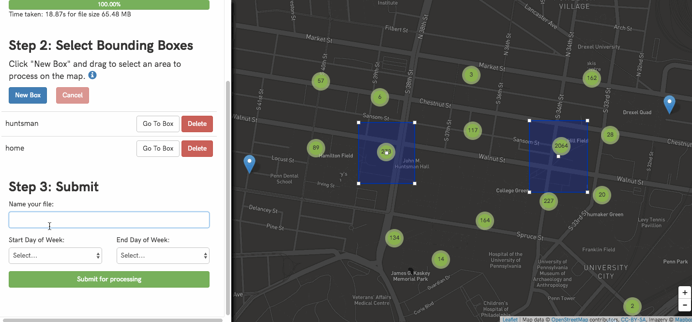

# Community Legal Services [Fall-2016]

This is a Hack4Impact Project for Community Legal Services. Try it out [here](https://www.clscsv.herokuapp.com).

## Team Members
* Krishna Bharathala (Project Manager)
* Santiago Buenahora
* Rachel Hong
* Katie Jiang
* Abhinav Suri (Technical Lead)
* Daniel Zhang

## Project

This app processes Google Location data into a CSV Files based on bounding boxes.

## Demos

### Tutorial for downloading your location data

### Uploading your location data

### Creating bounding boxes

### Submitting your data and creating CSV

